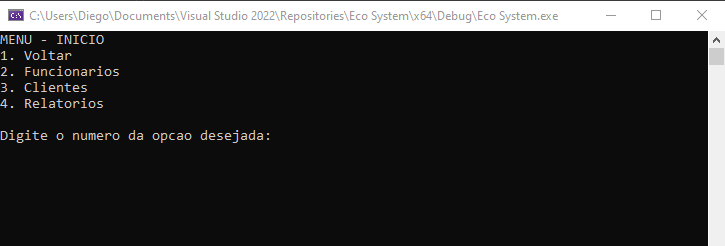
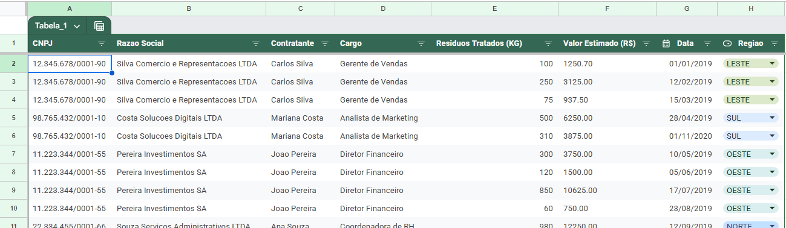

# ♻️ Eco System - CLI 

*Um sistema de gerenciamento para empresas de tratamento de resíduos desenvolvido em C puro*

---

## 🚀 Visão Geral

Este projeto acadêmico foi desenvolvido para consolidar conceitos fundamentais de **ciência da computação**, incluindo estrutura de dados, gerenciamento de memória e programação modular. O sistema permite o gerenciamento completo de:
- 👥 Funcionários 
- 👨 Clientes
- 📦 Serviços prestados
- 💸 Relatórios financeiros

*Operado totalmente via terminal com interface intuitiva de menus interativos!*

---

## ⚙️ Funcionalidades Principais

### 🔒 Módulo de Autenticação
- 👨 Cadastro/login de funcionários
- 📂 Armazenamento em arquivos estruturados

### 🎲 Gestão de dados
- ✅ `Criar` novos registros (funcionários/clientes/serviços)
- 🔍 `Consultar` dados com filtros
- ✏️ `Atualizar` informações
- ❌ `Remover` entradas

### 📊 Relatórios
- Listagem de clientes ativos
- Histórico de serviços

---

## ✨ Destaques Técnicos

### ✅ Pontos Fortes

- 📚 **Código Bem Documentado**  
  *Comentários explicativos e documentação interna*

- 🧠 **Gestão Eficiente de Memória**  
  *Uso estratégico de `malloc()`, `calloc()` e `free()`*

- 🏗️ **Arquitetura Modular**  
  *Separação de responsabilidades entre arquivos e estruturas*

- 🔒 **Separação de Responsabilidades**  
  *Funções especializadas com baixo acoplamento*

---

## 🔧 Melhorias Futuras

### 🚧 Limitações Atuais
- 🖥️ Interface textual básica
- 🔓 Dados sensíveis armazenados sem criptografia
- 📝 Validações insuficientes

### 💡 Sugestões de Evolução
- Implementar **criptografia** para senhas e dados sensíveis
- Adicionar sistema de logs
- Desenvolver testes unitários

---

## 🛠️ Como Usar no Visual Studio  

1. **Abra o projeto**  
   - Clone o repositório via `Git > Clone` no menu do Visual Studio  
   - Ou baixe o ZIP e extraia os arquivos  

2. **Carregue a Solution**  
   - Abra o arquivo `Eco System.sln` na pasta principal  

3. **Execute!**  
   - Aperte **Ctrl + F5** (ou `Debug > Start Without Debugging`)  
   - O console ficará aberto após a execução  

---

## 📸 Sistema em Ação

  
  
  

---

## 🤝 Contribuição
Contribuições são bem-vindas! Siga o padrão de código existente e documente novas funcionalidades.

*Desenvolvido com ❤️ para fins educacionais*
